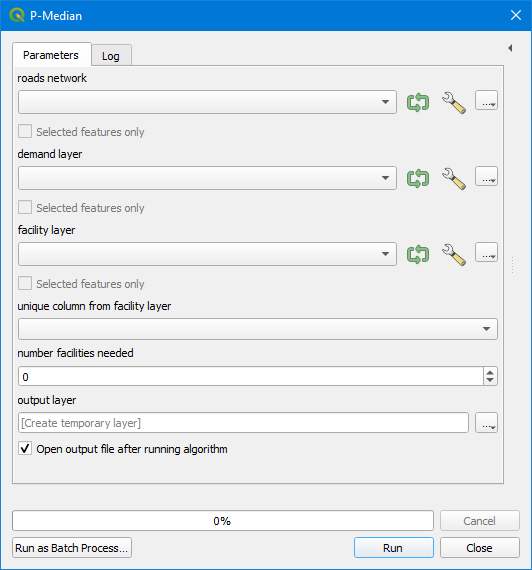
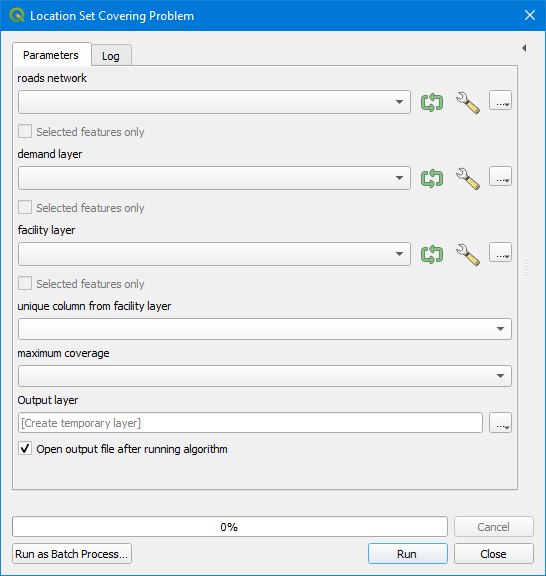
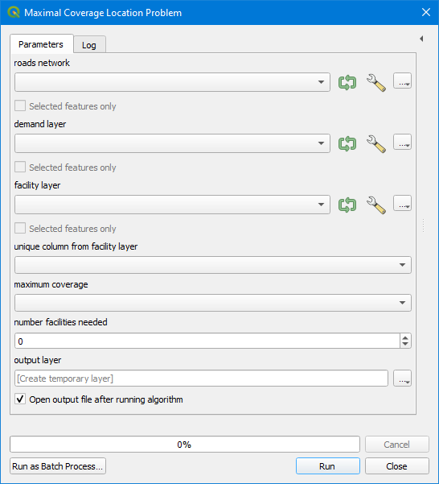
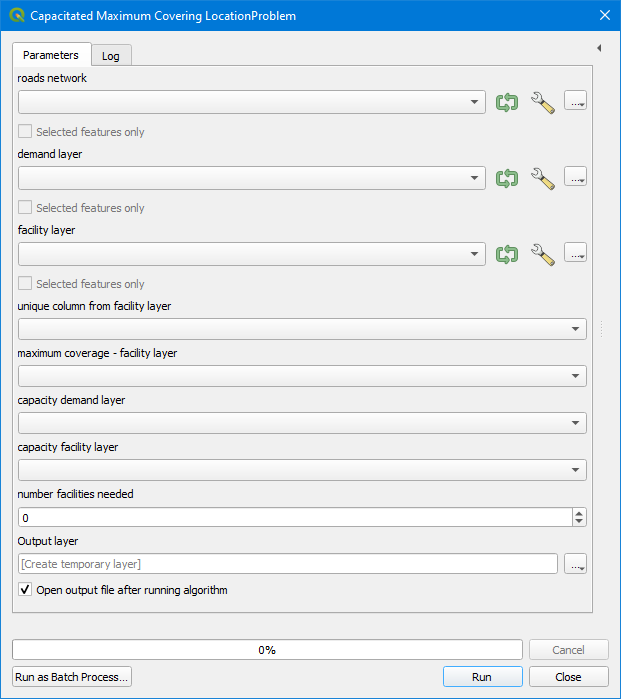
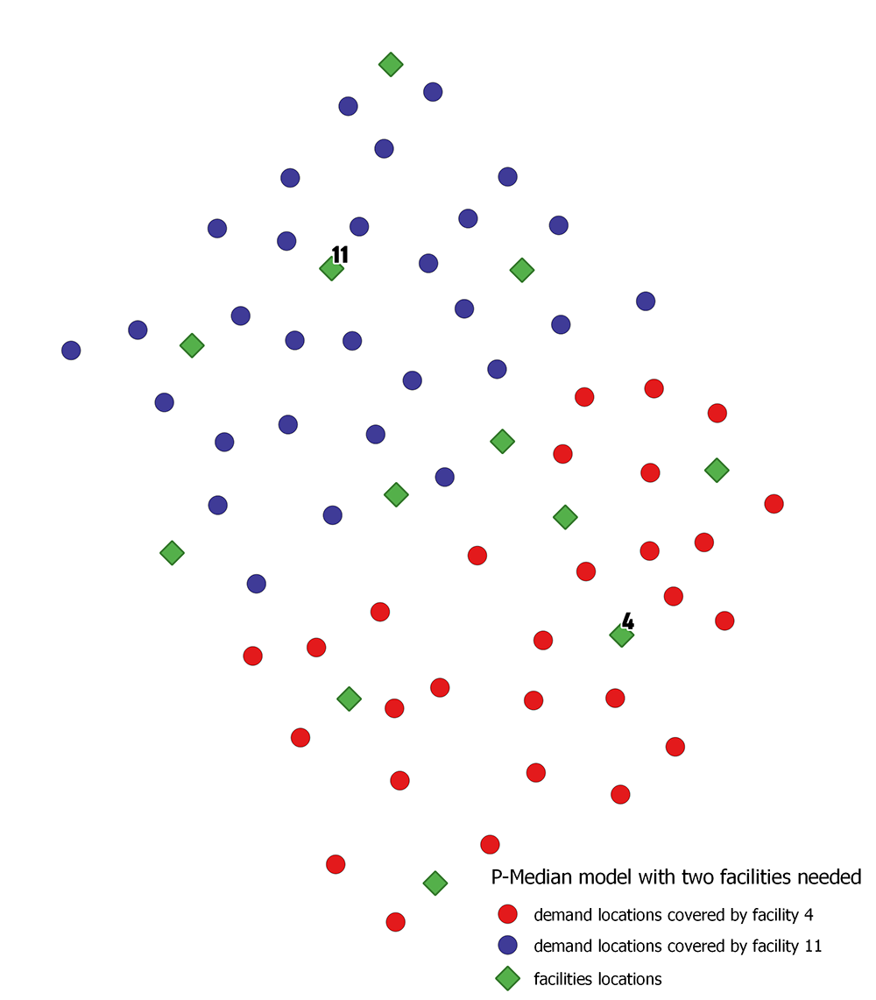

# Location Allocation Models
I've developed the P-Median model, Location Set Covering model, Maximum Coverage Location model, and capacity Maximum Coverage Location model as QGIS tools to provide these to GeoMore office.

these models have been designed to optimize location where Locate number of facilities such that the resulting sum of travel distances is minimized.
for example, when someone calls for an ambulance, we trust it will come to their aid almost instantly; the emergency response time depends considerably on the distance between the ambulance and the patient Typically, the goal of determining the best sites for ERS centers is to make it possible for ambulances to reach the most people within a defined time frame. 

the specific question may be: Where should three ERS facilities be placed so that the greatest number of people in the community can be reached within four minutes?
Here the models answer by locating three perfect ERS facilities.

* ### P-Median model

* ### Location Set Covering model

* ### Maximum Coverage Location model

* ### capacity Maximum Coverage Location model

* ### an example to use p-median model with two facilities needed

```python
## yasser Ismail
```
