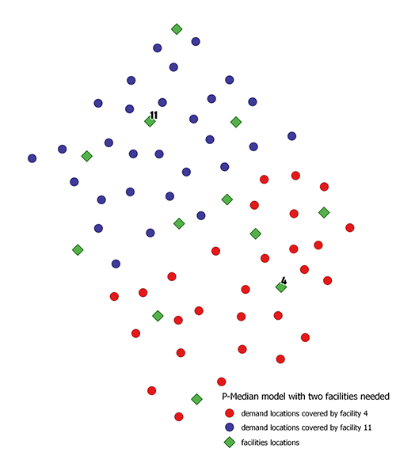

# 🗺️ Location Allocation Models in QGIS

This project presents a suite of **location-allocation optimization models** developed as QGIS processing tools. The tools aim to support strategic decision-making in public service placement, such as emergency response stations, clinics, or logistics hubs.

Developed and delivered to **GeoMore Office**, these models help answer critical questions like:

> 📍 *"Where should we place a fixed number of facilities so that we either minimize travel distance or maximize demand coverage within a certain threshold?"*

## 🧠 Why Location Allocation Matters

Imagine someone calls for an ambulance—timely response is crucial. Emergency response time is heavily affected by the **distance** between the caller and the facility. These models help planners identify **optimal facility locations** to:
- Minimize total or average travel distance
- Maximize the number of people reached within a specific time/distance
- Ensure all demand points are covered with the fewest possible facilities
- Account for capacity constraints at facilities

---

## 🚦 Models Included

### 1️⃣ P-Median Model
> Locates `p` facilities to **minimize the total distance** between demand points and their assigned facility.

---

### 2️⃣ Location Set Covering Model
> Minimizes the **number of facilities** required to **cover all demand points** within a maximum distance or time threshold.

---

### 3️⃣ Maximal Coverage Location Problem (MCLP)
> Selects a fixed number of facilities to **maximize the covered demand** within a specified distance or time.

---

### 4️⃣ Capacitated Maximum Coverage Location Problem
> Extends MCLP by incorporating **capacity constraints**, ensuring demand does not exceed facility capacity.

---

## 📊 Example Output – P-Median with 2 Facilities

Below is a sample result showing how demand points are assigned to 2 selected facilities using the P-Median model.

---

### 👨‍💻 **Author**

* **Yasser I. Barhoom**
* **Geospatial Engineer**

---

## 🧩 Tools & Platform

* QGIS Processing Toolbox
* Python (PyQGIS)
* GIS Network Analysis
* Location-allocation algorithms